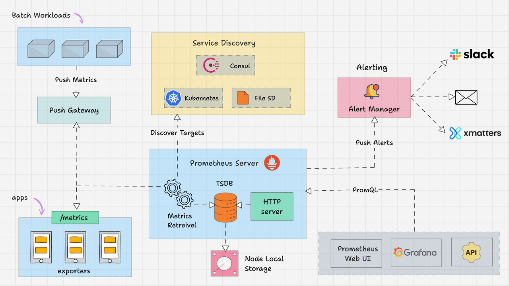

# Prometheus Stack Architecture

Prometheus is an open-source monitoring and alerting system written in Go that collects and processes metrics from various targets using a pull model.

## Prometheus Server

Uses **pull** model for scraping metrics from **targets** based on scrape intervals

## Time-Series Database (TSDB)

* Stores metric data in efficient **chunks** on local disk
* Supports **retention policies**:
  - Time-based: Default 15 days
  - Size-based: Maximum storage limit
* Offers remote storage options for scalability

## Targets

* Sources where Prometheus scrapes metrics (servers, pods, endpoints)
* Default metrics path: `/metrics`
* Configured under `scrape_configs` in config file

## Exporters

* **Agents** that convert system metrics to Prometheus format
* Examples: Node Exporter (CPU/memory), ElastiSearch Exporter

## Service Discovery

* Static configs: targets with static endpoints
* Dynamic discovery: For auto-scaling systems (Kubernetes, EC2, Consul)
* Example: `kubernetes_sd_configs` for Kubernetes pods

## Push Gateway

* Handles push-based metrics for short-lived jobs
* Acts as intermediate gateway
* Jobs push metrics via HTTP API
* Stores metrics temporarily in memory

## Client Libraries

* Libraries for custom instrumentation
* Available for most programming languages
* Used to expose custom metrics in Prometheus format

## Alert Manager

* Manages alerts from Prometheus
* Features: Deduplication, Grouping, Silencing, Routing by severity, Inhibition
* Supports multiple notification channels (email, Slack, PagerDuty)

## PromQL

* Query language for time-series data
* Used in Prometheus UI, CLI, or Grafana dashboards
