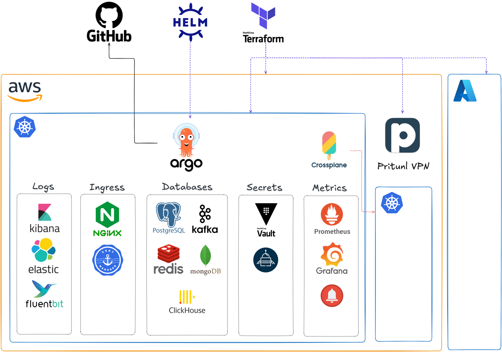

# DevOps Sandbox

All in one project with useful **devops practices** and tools, **demo** of my skills, **sandbox** for learning new tools, infra **foundation** for companies of any size.

* **terraform:** provision clouds, vpn, common kubernetes clusters
* **argocd**: provision applications gitops way
* **apps deploy:** monorepo

## Further reading

- **[Infrastructure](infra/infra.md)** -- detailed documentation of the whole infra-platform
- **[Roadmap](roadmap.md)** -- what's done, what's next, what's planned
- **[Demo](/demo)** -- run devops-sandbox yourself
