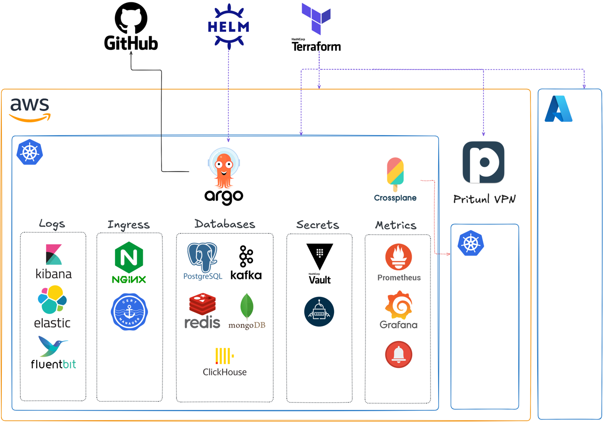
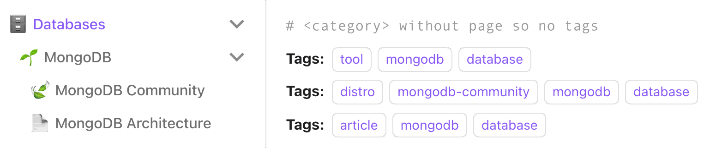

# DevOps Sandbox

All in one project with useful **devops practices** and tools as **demo** of my skills, **sandbox** for learning new tools and **infra foundation** for companies of any size.

**Lead technologies:**

* **terraform:** provision clouds, vpn, common **kubernetes** clusters
* **crossplane:** provision additional environments
* **argocd**: provision applications **gitops** way
* **helm appchart:** DRY app configuration on different environments

## How to read docs

**This documentation is organized hierarchically using four key components:**

- **Categories** - Large-scale topics like Infrastructure, Observability, Databases
- **Tools** - Core technologies like Kubernetes, Prometheus, MongoDB
- **Distros** - Specific implementations like MongoDB Community Operator
- **Articles** - Implementation guides and tutorials (accessible by links on pages)

📖 **[Full documentation structure and guidelines →](docs.md)**

## Further reading

- **[Infrastructure](infra/infra.md)** -- detailed documentation of the whole infra-platform
- **[Roadmap](roadmap.md)** -- what's done, what's next, what's planned
- **[Demo](/demo)** -- run devops-sandbox yourself
