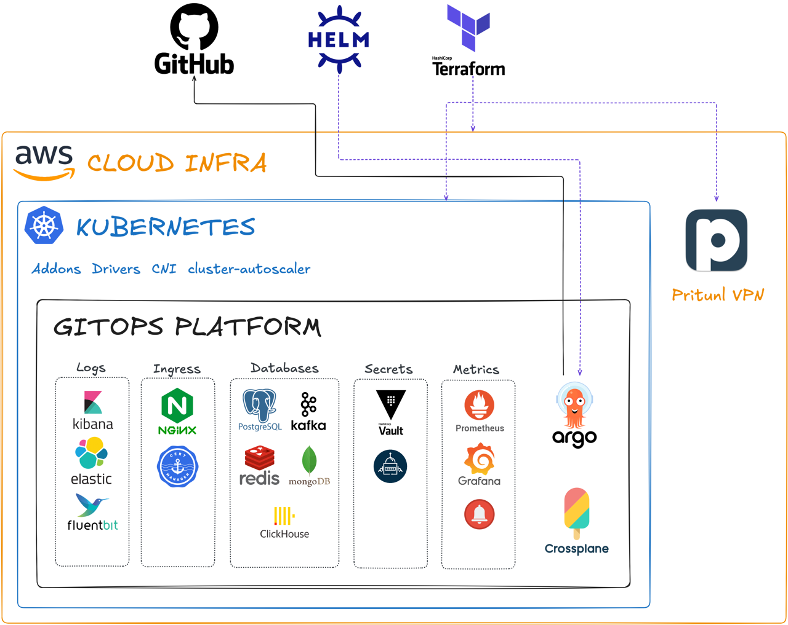

---
tags:
- category
- infrastructure
---

# Infrastructure

## [Cloud infra](cloud)

* Terragrunt/Crossplane provisoned
* Corporate VPN
* Cloud Networking (VPC)
* Access management (IAM)
* Private container registry (ECR)

## [Kubernetes cluster](k8s)

* Terragrunt/Crossplane provisoned
* Addons, SCI Drivers, CNI, Autoscaler
* Load balancer for ingress
* IRSA

## [GitOps Platform](platform)

* Everything managed by ArgoCD
* Git as source of truth
* Deploy new app in single commit
* Single configuration file for every app needs
* DRY configuration system
* IDP

## [CI/CD](cicd)

* Continuous Delivery / Continuous Deployment
* Universal Pipelines run on any platform (local, jenkins, github actions, gitlab ci.. etc)
* Independent from any cicd tools
