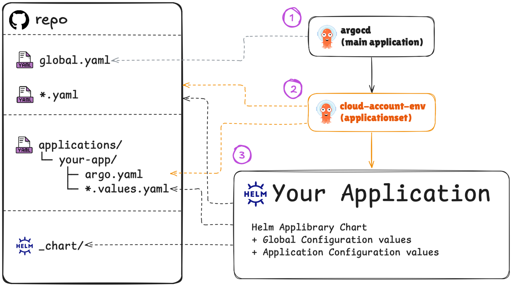

---
tags:
- category
- platform
- infrastructure
---

# GitOps Platform

Implementation of GitOps architecture using ArgoCD with multi-dimensional configuration management across clouds, accounts, and environments.



### **[ArgoCD](argocd)** + **[Applibrary](applibrary)** + **[Configuration](articles/config)**

1. **Main ArgoCD Application**

Read infrastructure schema from `global.yaml` and creates ApplicationSet per each cluster-account-environment combination.

```yaml title="global.yaml"
clouds:
  - name: aws
    accounts:
      - name: main
        environments:
          - name: common
          - name: stage
      - name: dedicated
        environments:
          - name: production
```

2. **ApplicationSet cluster-account-environment**

Search gitops repository for `argo.yaml` and creates applications based on settgins.

```yaml title="application/ypur-app/argo.yaml"
destination: all
namespace: api
autosync: true
syncOptions:
  - SkipDryRunOnMissingResource=true
```

3. **Application**

* helm chart that uses [Helm Applibrary](applibrary) as a dependency
* add [global configuration](articles/config#global-configuration-schema) values files
* add its [own configuration](articles/config#application-configuration-schema) values files

### Key features

* ArgoCD managed everything
* ApplicationSet per cluster
* Monorepo for infra applications
* Dynamic application repo discovery
* Sophisticated DRY configuration hierarchy
* Developer Platform: ~0% ClickOps / ~100% GitOps

## Tools

* `crossplane`
* `keda`
* `reloader`

